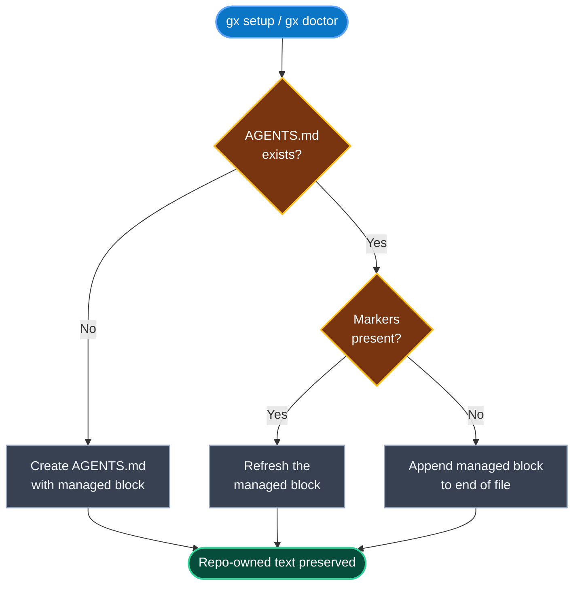

# GitGuardex — Guardian T-Rex for your repo

[](https://www.npmjs.com/package/@imdeadpool/guardex)
[](https://www.npmjs.com/package/@imdeadpool/guardex)
[](https://github.com/recodeee/gitguardex/stargazers)
[](./LICENSE)

[](https://github.com/recodeee/gitguardex/actions/workflows/ci.yml)
[](https://github.com/recodeee/gitguardex/actions/workflows/release.yml)
[](https://github.com/recodeee/gitguardex/actions/workflows/codeql.yml)
[](https://securityscorecards.dev/viewer/?uri=github.com/recodeee/gitguardex)

**GitGuardex is a safety layer for parallel agent work in git repos.** If you're running more than one Codex or Claude agent on the same codebase, this is what keeps them from deleting each other's work.

> [!WARNING]
> Not affiliated with OpenAI, Anthropic, or Codex. Not an official tool.

> [!IMPORTANT]
> GitGuardex is still being tested in real multi-agent repos. If something feels rough or broken, especially around cleanup, finish, merge, or recovery flows, sorry. We need to test those paths under real load first, and we'll patch issues as we find them.

---

## The problem


I was running ~30 Codex agents in parallel and hit a wall: they kept working on the same files at the same time — especially tests — and started overwriting or deleting each other's changes. More agents meant *less* forward progress, not more. Classic de-progressive loop.

### Solution

GitGuardex exists to stop that loop. Every agent gets its own worktree, claims the files it's touching, and can't clobber files another agent has claimed. Your local branch stays clean; agents stay in their lanes.


<p align="center">
  
</p>

<h3 align="center">Install in one line</h3>

```bash
npm i -g @imdeadpool/guardex
```

<p align="center">
  <sub>
    Then <code>cd</code> into your repo and run <code>gx setup</code> — hooks, scripts, templates,
    and OMX&nbsp;/&nbsp;OpenSpec&nbsp;/&nbsp;caveman wiring all scaffold in one go.
  </sub>
</p>

<p align="center">
  <a href="https://www.npmjs.com/package/@imdeadpool/guardex"></a>
  <a href="https://www.npmjs.com/package/@imdeadpool/guardex"></a>
  <a href="https://github.com/recodeee/gitguardex/stargazers"></a>
</p>

### Dashboard


Coming soon: [recodee.com](https://recodee.com) — live account health, usage, routing, and capacity in one place.

---

## What it does

- **Isolated `agent/*` branch + worktree per task** — agents never share a working directory.
- **Explicit file lock claiming** — an agent declares which files it's editing before it edits them.
- **Deletion guard** — claimed files can't be removed by another agent.
- **Protected-base safety** — `main`, `dev`, `master` are blocked by default; agents must go through PRs.
- **Auto-merges agent configs into every worktree** — `oh-my-codex`, `oh-my-claudecode`, caveman mode, and OpenSpec all get applied automatically so every spawned agent starts tuned, not bare.
- **Repair/doctor flow** — when drift happens (and it will), `gx doctor` gets you back to a clean state.
- **Auto-finish** — when Codex exits a session, Guardex commits sandbox changes, syncs against the base, retries once if the base moved, and opens a PR.

---

## Quick start

```sh
npm i -g @imdeadpool/guardex
cd /path/to/your/repo
gx setup
```

That's it. Setup installs hooks, scripts, templates, and scaffolds OpenSpec/caveman/OMX wiring. Aliases: `gx` (preferred), `gitguardex` (full), `guardex` (legacy).

---

## How `AGENTS.md` and `CLAUDE.md` are handled

> [!IMPORTANT]
> **GitGuardex never overwrites your guidance.** Only the content between these markers is managed:
>
> ```text
> <!-- multiagent-safety:START -->
>   ... managed content ...
> <!-- multiagent-safety:END -->
> ```
>
> Everything outside that block is preserved byte-for-byte.

### Behavior at a glance

<div align="center">

| Your repo has&hellip; | `gx setup` / `gx doctor` does&hellip; |
| :--- | :--- |
| `AGENTS.md` **with** markers | Refreshes **only** the managed block |
| `AGENTS.md` **without** markers | Appends the managed block to the end |
| No `AGENTS.md` | Creates it with the managed block |
| A root `CLAUDE.md` | Leaves it alone |

</div>

> [!NOTE]
> In this repo, `CLAUDE.md` is a symlink to `AGENTS.md`, so Claude reads the same contract. Claude-specific command guidance is installed separately at `.claude/commands/gitguardex.md`.

### Decision flow



### What actually changes

```diff
  # AGENTS

  Project-specific guidance before managed block.

  <!-- multiagent-safety:START -->
- - old managed contract
+ - current GitGuardex-managed contract
  <!-- multiagent-safety:END -->

  Trailing repo notes after managed block.
```

Only lines **inside** the marker block change. Everything above and below is preserved exactly.

---

## What `gx` shows first

Before you branch, repair, or start agents, run plain `gx`. It gives you a one-screen status view for the CLI, global helpers, repo safety service, current repo path, and active branch.


Use `gx setup` the first time you wire GitGuardex into a repo. It bootstraps the managed hooks, scripts, templates, and optional workspace/OpenSpec wiring. If the repo drifts later, use `gx doctor` as the repair path: it reapplies the managed safety files, verifies the setup, and on protected `main` it auto-sandboxes the repair so your visible base branch stays clean.

---

## Daily workflow

Per new agent task:

```sh
# 1) Start isolated branch/worktree
bash scripts/agent-branch-start.sh "task-name" "agent-name"

# 2) Claim the files you're going to touch
python3 scripts/agent-file-locks.py claim \
  --branch "$(git rev-parse --abbrev-ref HEAD)" <file...>

# 3) Implement + verify
npm test

# 4) Finish (commit + push + PR + merge + cleanup)
bash scripts/agent-branch-finish.sh \
  --branch "$(git rev-parse --abbrev-ref HEAD)" \
  --base main --via-pr --wait-for-merge --cleanup
```

If you use `scripts/codex-agent.sh`, the finish flow runs automatically when the Codex session exits — it auto-commits, retries once after syncing if the base moved during the run, then pushes and opens the PR.

Guardex normally prunes merged sandboxes for you as part of the finish flow. If you simply do not want a local sandbox/worktree anymore, remove that worktree directly; delete the branch too only if you are intentionally abandoning that lane:

```sh
git worktree remove .omx/agent-worktrees/<worktree-name>
# Claude Code sandboxes live under .omc/agent-worktrees/<worktree-name>
git branch -D agent/<role>/<task>   # optional, only if you are discarding the lane
```

Running Codex across several existing worktrees (e.g. from VS Code Source Control)? Finalize everything ready at once:

```sh
gx finish --all
```

Codex sessions default to `.omx/agent-worktrees/`. Claude Code sessions default to `.omc/agent-worktrees/`, so Claude sandboxes stay under the Claude runtime folder instead of sharing the Codex root.

---

## Visual reference

| | |
|---|---|
|  | **`gx setup`** — bootstraps everything in one command |
|  | **`gx status`** — health check for tools, hooks, services |
|  | **Branch/worktree start protocol** |
|  | **Lock + delete-guard protocol** |
|  | **VS Code Source Control view** with agent + OpenSpec files |

### How It Works In VS Code

This is the real Source Control shape Guardex is aiming for: isolated agent branches, clear OpenSpec artifacts, and no pile-up on one shared checkout.


To install the real companion into local VS Code from a Guardex-wired repo:

```sh
node scripts/install-vscode-active-agents-extension.js
```

It adds an `Active Agents` view to the Source Control container, reads `.omx/state/active-sessions/*.json`, and uses VS Code's native `loading~spin` codicon for the running-state affordance. Reload the VS Code window after install.

---

## Commands

### Core

```sh
gx status                 # health check (default)
gx status --strict        # exit non-zero on findings
gx setup                  # full bootstrap
gx setup --repair         # repair only
gx setup --install-only   # scaffold templates, skip global installs
gx doctor                 # repair + verify (auto-sandboxes on protected main)
```

### Targeting other repos

```sh
gx setup --target /path/to/repo
gx doctor --target /path/to/repo

# optional: VS Code workspace showing repo + agent worktrees
gx setup --target /path/to/repo --parent-workspace-view
```

### Monorepo support

Setup auto-installs into every nested git repo (e.g. `apps/*/.git`). Submodules and worktrees under `.omx/agent-worktrees/` or `.omc/agent-worktrees/` are skipped.

```sh
gx setup --target /mainfolder
gx setup --target /mainfolder --no-recursive
```

### Fresh repos + Docker Compose

On a brand-new repo, `gx setup` now prints the next real steps too: commit the scaffold, start the first agent branch, and add `origin` if you want finish/merge flows to leave the machine.

If the repo already has `docker-compose.yml`, `docker-compose.yaml`, `compose.yml`, or `compose.yaml`, setup also points you at the bundled Docker loader:

```sh
GUARDEX_DOCKER_SERVICE=app bash scripts/guardex-docker-loader.sh -- npm test
```

When the service is already running, the loader uses `docker compose exec`; otherwise it falls back to `docker compose run --rm`.

### Protected branches

```sh
gx protect list
gx protect add release staging
gx protect remove release
gx protect set main release hotfix
gx protect reset
```

Defaults: `dev`, `main`, `master`. Stored in git config key `multiagent.protectedBranches`.

### Sync current agent branch

```sh
gx sync --check
gx sync
```

### Background bots

```sh
gx agents start           # review monitor + stale cleanup
gx agents stop
gx agents status

# tuning
gx agents start --review-interval 30 --cleanup-interval 60 --idle-minutes 10
```

### Lifecycle

```sh
gx finish --all           # commit + PR + merge every ready agent/* branch
gx cleanup                # prune merged/stale branches and worktrees
gx cleanup --watch --interval 60
gx cleanup --idle-minutes 10
gx cleanup --watch --once --interval 60
gx release                # create/update the current GitHub release from README notes
```

### Release publishing

`gx release` is the maintainer path for package releases. It reads the versioned sections under `README.md -> Release notes`, finds the last published GitHub release, and writes one grouped GitHub release body covering everything newer than that release and up to the current package version.

That GitHub release then triggers `.github/workflows/release.yml`, which performs the actual `npm publish --provenance --access public` step.

### Prompts for your agents

```sh
gx prompt                 # full checklist (paste into Codex/Claude)
gx prompt --exec          # commands only
gx prompt --snippet       # AGENTS.md managed-block template
```

### Reports

```sh
gx report scorecard --repo github.com/recodeee/gitguardex
```

---

## v6 → v7 migration

Five commands were consolidated into flags. Old names still work and print a deprecation notice; they'll be removed in v8.

| v6                          | v7                            |
| --------------------------- | ----------------------------- |
| `gx init`                   | `gx setup`                    |
| `gx install`                | `gx setup --install-only`     |
| `gx fix`                    | `gx setup --repair`           |
| `gx scan`                   | `gx status --strict`          |
| `gx copy-prompt`            | `gx prompt`                   |
| `gx copy-commands`          | `gx prompt --exec`            |
| `gx print-agents-snippet`   | `gx prompt --snippet`         |
| `gx review`                 | `gx agents start`             |

---

## Default behavior

A few things worth knowing up front:

- Running `gx` with no command opens the status/health view.
- `gx init` is just an alias for `gx setup`.
- Setup/doctor can install missing companion tooling (OMC runtime, OpenSpec, cavemem, codex-auth, caveman, cavekit) — but only with explicit Y/N confirmation.
- Direct commits/pushes to protected branches are **blocked** by default. Agents must use the `agent/*` + PR flow.
- **Exception:** VS Code Source Control commits are allowed on protected branches that exist only locally (no upstream, no remote branch).
- On protected `main`, `gx doctor` auto-runs in a sandbox agent branch/worktree so it can't touch your real main.
- In-place agent branching is disabled. `scripts/agent-branch-start.sh` always creates a separate worktree so your visible local/base branch never changes.
- Fresh sandbox branches start with no git upstream. Guardex records the protected base in `branch.<name>.guardexBase`, and the first `git push -u` publishes the real upstream.
- Interactive self-update prompt defaults to **No** (`[y/N]`).

Optional override for manual VS Code protected-branch writes:

```sh
git config multiagent.allowVscodeProtectedBranchWrites true
```

---

## Companion tools

GitGuardex is designed to work alongside these. All optional — but if you're running many agents, you probably want them. `gx status` reports the machine-detectable companion helpers, including local `caveman` / `cavekit` installs when their home-directory footprints are present.

```text
● oh-my-codex: active
● oh-my-claude-sisyphus: active
● @fission-ai/openspec: active
● cavemem: active
● cavekit: active
● caveman: active
● @imdeadpool/codex-account-switcher: active
● gh: active
```

### oh-my-codex — Codex config + skills framework

Loads skills, slash commands, and session defaults into Codex. Guardex merges `oh-my-codex` into every agent worktree automatically, so every spawned agent starts with the same tuned config instead of vanilla Codex.

```sh
npm i -g oh-my-codex
```

Repo: <https://github.com/Yeachan-Heo/oh-my-codex>
[](https://github.com/Yeachan-Heo/oh-my-codex)

### oh-my-claudecode — Claude Code equivalent

Claude-side mirror of oh-my-codex. Same idea: skills, commands, and defaults loaded into every Claude Code session. Guardex merges it into worktrees alongside oh-my-codex so mixed Codex + Claude agent fleets behave consistently. For the npm CLI/runtime path, the published package name is `oh-my-claude-sisyphus`.

```sh
npm i -g oh-my-claude-sisyphus@latest
```

Repo: <https://github.com/Yeachan-Heo/oh-my-claudecode>
[](https://github.com/Yeachan-Heo/oh-my-claudecode)

### Caveman — output compression for long agent runs

Ultra-compressed response mode for Claude/Codex-style agents. Useful when you want less output-token churn during long reviews, debug loops, or multi-agent sessions.

```sh
npx skills add JuliusBrussee/caveman
```

Repo: <https://github.com/JuliusBrussee/caveman>
[](https://github.com/JuliusBrussee/caveman)

### Cavemem — local persistent memory for agents

Cross-agent memory with local SQLite + MCP. Helpful when you want Codex or Claude sessions to retain compressed history across runs. `gx setup` can install the CLI; you still run the IDE wiring once per machine.

```sh
npm install -g cavemem
cavemem install --ide codex
cavemem status
```

Repo: <https://github.com/JuliusBrussee/cavemem>
[](https://github.com/JuliusBrussee/cavemem)

### Cavekit — spec-driven build loop

Spec-driven workflow layer for building from durable specs with explicit build/check commands. The current install path also brings in its `spec`, `build`, `check`, `caveman`, and `backprop` skills.

```sh
npx skills add JuliusBrussee/cavekit
```

Repo: <https://github.com/JuliusBrussee/cavekit>
[](https://github.com/JuliusBrussee/cavekit)

### OpenSpec — spec-driven workflows

Structured plan/change/apply/archive flow for agents. Prevents them from drifting off-task on long jobs. Full guide: [`docs/openspec-getting-started.md`](./docs/openspec-getting-started.md).

```sh
npm i -g @fission-ai/openspec
```

Repo: <https://github.com/Fission-AI/OpenSpec>
[](https://github.com/Fission-AI/OpenSpec)

### codex-auth — multi-account switcher

For multi-identity Codex workflows. I built this because switching accounts manually for 30 agents was impossible. Auto-registers accounts to a dashboard on `codex login` so you can see every account and switch with one command.

```sh
npm i -g @imdeadpool/codex-account-switcher

codex-auth save <name>
codex-auth use <name>
codex-auth list --details
codex-auth current
```

Repo: [recodeecom/codex-account-switcher-cli](https://github.com/recodeecom/codex-account-switcher-cli)
[](https://github.com/recodeecom/codex-account-switcher-cli)

### GitHub CLI (`gh`)

Required for PR/merge automation. `agent-branch-finish.sh` and `codex-agent.sh` auto-finish both depend on it.

```sh
# https://cli.github.com/
gh --version
gh auth status
```

### Pull app — fork auto-sync

Guardex installs a starter config at `.github/pull.yml.example`.

```sh
cp .github/pull.yml.example .github/pull.yml
# edit rules[].base and rules[].upstream
```

Install the app: <https://github.com/apps/pull>
Validate: `https://pull.git.ci/check/<owner>/<repo>`

### CR-GPT — AI PR reviews

Install: <https://github.com/apps/cr-gpt>

`gx setup` installs `.github/workflows/cr.yml`. Add `OPENAI_API_KEY` under `Settings → Secrets and variables → Actions → Secrets`. After that, new and updated PRs get reviewed automatically.

---

## OpenSpec integration

If you installed OpenSpec during setup (`@fission-ai/openspec`), the full guide is at [`docs/openspec-getting-started.md`](./docs/openspec-getting-started.md).

Default flow:

```text
/opsx:propose <change-name> → /opsx:apply → /opsx:archive
```

Expanded flow:

```text
/opsx:new <change-name> → /opsx:ff or /opsx:continue → /opsx:apply → /opsx:verify → /opsx:archive
```

### OpenSpec in agent sub-branches

- `scripts/codex-agent.sh` enforces OpenSpec workspaces before launching Codex.
- `scripts/agent-branch-start.sh` can scaffold both `openspec/changes/<slug>/` and `openspec/plan/<slug>/` when `GUARDEX_OPENSPEC_AUTO_INIT=true`.
- The collaboration section in `tasks.md` is there for real cleanup handoffs too. If the first Codex/Claude session finishes the implementation work but hits a usage limit before `agent-branch-finish --cleanup`, hand the same sandbox to another agent, let that agent finish cleanup, and record the join/handoff in the change task.

Environment variables:

| Var | Purpose |
|---|---|
| `GUARDEX_OPENSPEC_AUTO_INIT` | `true` to auto-bootstrap on branch start (default `false`) |
| `GUARDEX_OPENSPEC_PLAN_SLUG` | force a specific plan workspace name |
| `GUARDEX_OPENSPEC_CHANGE_SLUG` | force a specific change workspace name |
| `GUARDEX_OPENSPEC_CAPABILITY_SLUG` | override capability folder for `spec.md` scaffolding |

---

## Files installed by setup

```text
scripts/agent-branch-start.sh
scripts/agent-branch-finish.sh
scripts/codex-agent.sh
scripts/review-bot-watch.sh
scripts/agent-worktree-prune.sh
scripts/agent-file-locks.py
scripts/install-agent-git-hooks.sh
scripts/openspec/init-plan-workspace.sh
.githooks/pre-commit
.githooks/pre-push
.codex/skills/gitguardex/SKILL.md
.claude/commands/gitguardex.md
.github/pull.yml.example
.github/workflows/cr.yml
.omc/agent-worktrees
.omx/state/agent-file-locks.json
```

If `package.json` exists, setup also adds `agent:*` helper scripts.

---

## Frontend mirror

- Standalone frontend repo: <https://github.com/recodeee/gitguardex-frontend>
- This repo tracks the frontend under `frontend/` and auto-mirrors it via `.github/workflows/sync-frontend-mirror.yml` on changes to `main`.

Setup (in this repo):

1. `Settings → Secrets and variables → Actions`
2. Add secret `GUARDEX_FRONTEND_MIRROR_PAT` with `contents:write` on `recodeee/gitguardex-frontend`

Optional overrides (Actions Variables):

- `GUARDEX_FRONTEND_MIRROR_REPO` (default `recodeee/gitguardex-frontend`)
- `GUARDEX_FRONTEND_MIRROR_BRANCH` (default `main`)

Manual run:

```sh
gh workflow run sync-frontend-mirror.yml
```

---

## Known rough edges

Being honest about where this still has issues:

- **Usage limit mid-task.** When an agent hits its Codex/Claude usage limit partway through, another agent may need to take over the same sandbox and run the remaining finish/cleanup steps. The OpenSpec collaboration checklist is there to capture that handoff, but it is still uglier than I'd like.
- **Conflict-stuck probes.** Fixed in v7.0.2 — earlier versions could leak `__source-probe-*` worktrees when the sync-guard rebase hit conflicts. If you're on an older release, `gx cleanup` sweeps these.
- **Windows.** Most of the hook surface assumes a POSIX shell. Use WSL or symlink-enabled git if you're on Windows.

PRs and issues welcome.

---

## Security & maintenance

- CI matrix on Node 18 / 20 / 22 (`npm test`, `node --check`, `npm pack --dry-run`)
- Trusted publishing with provenance via GitHub Actions
- OpenSSF Scorecard + Dependabot for Actions
- Disclosure policy in [`SECURITY.md`](./SECURITY.md)

---

## Local development

```sh
npm test
node --check bin/multiagent-safety.js
npm pack --dry-run
```

---

## Release notes

<details>
<summary><strong>v7.x</strong></summary>

### v7.0.16
- `gx doctor` now keeps nested repo repair runs visibly progressing, and overlapping integration work stays off the protected base branch instead of trying to merge back on `main`.
- Cleanup and finish flows are less brittle: `codex-agent` no longer waits on PRs that can never exist, and prune cleanup now walks both managed worktree roots so stale sandboxes get removed consistently.
- Mirror-sync diagnostics are quieter: when the mirror PAT is unset, Guardex now skips the sync path instead of marking the run red, and shared `ralplan` lanes stay easier to identify during handoff/debugging.
- Bumped `@imdeadpool/guardex` from `7.0.15` → `7.0.16` after npm rejected a republish over the already-published `7.0.15`.

### v7.0.15
- `gx doctor` no longer blocks recursive nested protected-repo repairs on child PR merge waits; nested sandboxes now force `--no-wait-for-merge` so the parent repair loop can continue.
- `gx setup` can now refresh managed files from protected `main` through a temporary sandbox branch/worktree, sync the managed outputs back to the visible base checkout, and prune the sandbox afterward.
- Bumped `@imdeadpool/guardex` from `7.0.14` → `7.0.15` after npm rejected a republish over the already-published `7.0.14`.

### v7.0.14
- Bumped `@imdeadpool/guardex` from `7.0.13` → `7.0.14` after npm rejected a republish over the already-published `7.0.13`.
- No package payload changes beyond the release metadata bump; this release exists so `npm publish` can proceed with a fresh semver.

### v7.0.13
- `gx status` and `gx setup` now present the Claude companion as `oh-my-claudecode` while still installing the published npm package `oh-my-claude-sisyphus`.
- When that dependency is inactive or the user declines the optional install, Guardex now prints the upstream repo URL so the missing dependency is explicit instead of hidden behind the npm package name.
- Bumped `@imdeadpool/guardex` from `7.0.12` → `7.0.13` after npm rejected a republish over the already-published `7.0.12`.

### v7.0.12
- Fixed the self-update handoff after `gx` installs a newer global package. When the on-disk install advances, GitGuardex now restarts into the installed CLI instead of continuing in the old process and printing the stale in-memory version.
- This removes the confusing `Updated to latest published version` followed by `CLI: ...7.0.10` mismatch that happened when `7.0.11` finished installing during the same `gx` invocation.
- Bumped `@imdeadpool/guardex` from `7.0.11` → `7.0.12`.

### v7.0.11
- Fixed the npm release workflow trigger so publishes run from `release.published` or explicit manual dispatch, instead of double-firing on both the tag push and the release event.
- This keeps the GitHub `npm` environment from collecting duplicate cancelled deploy cards for the same version and leaves one canonical release deployment to monitor.
- Bumped `@imdeadpool/guardex` from `7.0.10` → `7.0.11` so the next release can publish cleanly after `7.0.10` was already taken on npm.

### v7.0.10
- Primary user-facing long name is now **GitGuardex**. CLI/help presents `gitguardex` as the long-form command; `gx` stays the preferred short alias; `guardex` remains as legacy compatibility.
- Installed Codex/Claude startup files now use `gitguardex` paths: `.codex/skills/gitguardex/SKILL.md` and `.claude/commands/gitguardex.md`.
- Startup context shrunk further. Managed marker block + skill + command compressed from 4340 B → 1930 B across the three always-loaded template files.
- Bumped `@imdeadpool/guardex` from `7.0.9` → `7.0.10`.

### v7.0.9
- `gx doctor` and `gx setup` now refresh AGENTS with repo-toggle examples. Managed AGENTS block states Guardex is enabled by default and shows exact `.env` lines: `GUARDEX_ON=0` disables per repo, `GUARDEX_ON=1` re-enables.
- Bumped to `7.0.9`.

### v7.0.8
- Added `REPO TOGGLE` section to `gx` status/help output. Operators see the repo-local switch immediately.
- Bumped to `7.0.8`.

### v7.0.7
- Advanced next publish target past npm. Bumped to `7.0.7`.
- Fixed root package metadata drift in `package-lock.json` (root version had fallen behind manifest).

### v7.0.6
- **Fixed: self-updater lied about success.** `gx`'s update prompt runs `npm i -g @imdeadpool/guardex@latest` and previously trusted npm's exit code. When npm's resolution cache reported "changed 1 package" without actually overwriting files (known quirk, triggers when user just bumped N-1 → N in the same session, or with a warm metadata cache), the prompt kept re-firing on every subsequent `gx` invocation because the on-disk `package.json` was stale. `gx` now re-reads the globally installed `package.json` after `@latest` returns, compares its `version` to the advertised latest, and if they don't match runs a pinned retry `npm i -g @imdeadpool/guardex@<latest>` to force past the obstructing cache entry. If the pinned retry also fails, the user gets a clear hint (`npm root -g && npm cache verify`) instead of a silent loop.

### v7.0.5
- Added `oh-my-claude` to `gx status` global-toolchain check. Claude-side mirror of `oh-my-codex` is reported alongside existing services (`oh-my-codex`, `@fission-ai/openspec`, `@imdeadpool/codex-account-switcher`, `gh`).
- Added `.omc/` to the managed `.gitignore` block so Claude-specific runtime state (notepad, worktrees) stays out of commits, parity with `.omx/`.

### v7.0.4
- Fixed publish collision on npm. Bumped `7.0.3` → `7.0.4`.

### v7.0.3
- **Branch/worktree naming refactor.** `agent-branch-start.sh` now produces `agent/<role>/<task>-<YYYY-MM-DD>-<HH-MM>` instead of `agent/<role+account-email>/<snapshot-slug>-<task>-<cksum6>`. Account names and 6-hex checksums no longer leak into branch/worktree paths.
- **Role normalization.** `AGENT_NAME` collapses to `{claude, codex, <explicit>}` via (in order) `GUARDEX_AGENT_TYPE` env override, substring match against `claude`/`codex`, `CLAUDECODE=1` sentinel, or fallback to `codex`. Other roles (`integrator`, `executor`, etc.) pass through when set via `GUARDEX_AGENT_TYPE`.
- New `--print-name-only` flag for deterministic tests; honors `GUARDEX_BRANCH_TIMESTAMP` for reproducible output.
- `--tier` flag accepted silently for CLAUDE.md compatibility (scaffold sizing not wired through yet).

### v7.0.2
- **Fix: `__source-probe-*` worktree leak on conflict exit.** `agent-branch-finish.sh` was registering its `cleanup()` trap *after* the sync-guard rebase block, so when rebase hit conflicts and the script exited, the throwaway probe worktree was never removed. `gx doctor` sweeps accumulated one new probe per run.
- Cleanup trap is now installed immediately after probe creation, and aborts any in-progress `rebase`/`merge` before `worktree remove --force`.

### v7.0.1
- Maintenance release.

### v7.0.0
- **Breaking (soft).** Consolidated 17 commands into 12 visible commands with flag-based subcommands. Removed names still work but print a deprecation notice; will be removed in v8.
- **Token-usage improvements.** Trimmed auto-installed agent templates that live in every consumer repo and get loaded into every session:
  - `templates/AGENTS.multiagent-safety.md`: 6990 B → 1615 B (−77%)
  - `templates/codex/skills/guardex/SKILL.md`: 2732 B → 1086 B (−60%)
  - `templates/claude/commands/guardex.md`: 472 B → 357 B (−24%)
  - Total: 10194 B → 3058 B per consumer repo (−70%, ~1.5k fewer tokens per agent session).
- New `gx prompt` command replaces three prompt-emitting commands.
- New flag surface on `gx setup`: `--install-only`, `--repair`.
- New `gx status --strict` mirrors old `gx scan`.

</details>

<details>
<summary><strong>v6.x</strong></summary>

### v6.0.1
- Preserve existing repo-owned `AGENTS.md` marker content during `gx setup` / `gx doctor` by default; only rewrite marker blocks when `--force` is explicit.
- Preserve existing `agent:*` package scripts during setup/doctor repairs by default.
- Forward `--force` through sandboxed doctor execution.
- Added regression tests for both preservation behaviors.

### v6.0.0
- **Breaking** — removed legacy `musafety` bin alias and all `MUSAFETY_*` environment variables. Callers must migrate to `guardex` / `gx` and `GUARDEX_*`.
- **Breaking** — bootstrap manifest filename changed from `musafety-bootstrap-manifest.json` to `guardex-bootstrap-manifest.json`; existing sandbox worktrees must be pruned + re-bootstrapped.
- Rebranded `musafety` → `guardex` across scripts, templates, hooks, tests, docs.
- The descriptive phrase `multiagent-safety` (including `bin/multiagent-safety.js`) is preserved — only the short codename changed.

</details>

<details>
<summary><strong>v5.x</strong></summary>

### v5.0.17 – v5.0.10
Version bumps for npm publish continuity plus incremental fixes: doctor arg-parser restored (5.0.16), parent-workspace view added (5.0.15), OMX completion policy wording (5.0.11), OpenSpec sandbox bootstrap enforced (5.0.9), bin syntax regressions fixed (5.0.8).

### v5.0.6
- `gx cleanup` and auto-finish cleanup now prune clean agent worktrees by default. VS Code Source Control focuses on your local branch + worktrees with active changes.
- Added `gx cleanup --keep-clean-worktrees` to opt out.

### v5.0.2
- Auto-closes Codex sandbox branches through PR workflow; keeps merged branch/worktree sandboxes for explicit cleanup via `gx cleanup`.
- Runs `gx doctor` repairs from a sandbox when `main` is protected.
- Allows tightly guarded Codex-only commits for `AGENTS.md` / `.gitignore` on protected branches.

### v5.0.0
- Rebranded CLI to **GuardeX** with `gx`-first command UX.
- Published under scoped package name `@imdeadpool/guardex`.
- Enforced repeatable per-message agent branch lifecycle in setup/init flows.
- Added codex-auth-aware sandbox branch naming support.

</details>

<details>
<summary><strong>v0.4.x</strong></summary>

### v0.4.6
- Added repository metadata (`repository`, `bugs`, `homepage`, `funding`).
- Added CI workflow for Node 18/20/22.
- Added npm provenance release workflow, OpenSSF Scorecard, Dependabot for Actions.
- Added explicit `SECURITY.md` and `CONTRIBUTING.md`.

### v0.4.5
- Added optional pre-commit behind-threshold sync gate (`multiagent.sync.requireBeforeCommit`, `multiagent.sync.maxBehindCommits`).
- Added `gx sync` workflow (`--check`, strategies, report mode).
- `agent-branch-finish.sh` blocks finishing when source is behind `origin/<base>`.

### v0.4.4
- Added `scripts/agent-worktree-prune.sh` to templates/install.
- `agent-branch-finish.sh` auto-runs prune after merge.
- Added npm helper: `agent:cleanup`.

### v0.4.2
- Setup detects existing global OMX/OpenSpec installs first; skips global install if tools are present.
- Interactive approval is strict `[y/n]`.
- Added setup + workflow screenshots.

### v0.4.0
- Added setup-time Y/N approval for optional global install of `oh-my-codex` and `@fission-ai/openspec`.
- Added setup flags: `--yes-global-install`, `--no-global-install`.

</details>
