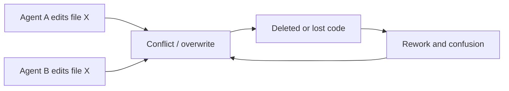

# GuardeX — Guardian T-Rex for your repo

[](https://www.npmjs.com/package/@imdeadpool/guardex)
[](https://github.com/recodeecom/multiagent-safety/actions/workflows/ci.yml)
[](https://securityscorecards.dev/viewer/?uri=github.com/recodeecom/multiagent-safety)

GuardeX is a safety layer for parallel Codex/agent work in git repos.

> [!WARNING]
> Not affiliated with OpenAI or Codex. Not an official tool.

## The problem (what was going wrong)

Multiple Codex agents worked on the same files at the same time.
They started overwriting or deleting each other's changes.
Progress became **de-progressive**: more activity, less real forward movement.

GuardeX exists to stop that loop.




## What GuardeX enforces

- isolated `agent/*` branch + worktree per task
- explicit file lock claiming before edits
- deletion guard for claimed files
- protected-base branch safety (`main`, `dev`, `master` by default)
- repair/doctor flow when drift appears

## Copy-paste: install + bootstrap

```sh
npm i -g @imdeadpool/guardex
cd /path/to/your/repo
gx setup
```

Alias support:

- preferred: `gx`
- full: `guardex`

## Copy-paste: daily workflow (per new user task)

```sh
# 1) Start isolated branch/worktree
bash scripts/agent-branch-start.sh "task-name" "agent-name"

# 2) Claim ownership
python3 scripts/agent-file-locks.py claim --branch "$(git rev-parse --abbrev-ref HEAD)" <file...>

# 3) Implement + verify
npm test

# 4) Finish (commit/push/PR/merge flow)
bash scripts/agent-branch-finish.sh --branch "$(git rev-parse --abbrev-ref HEAD)"

# 5) Optional cleanup after merge
gx cleanup --branch "$(git rev-parse --abbrev-ref HEAD)"
```

If you use `scripts/codex-agent.sh`, the finish flow is auto-run after the Codex session exits.

## Visual workflow

### Setup status


### Service logs/status


### Branch/worktree start protocol


### Lock + delete guard protocol


## Copy-paste: common commands

```sh
# health / safety status
gx status

# setup and repair
gx setup
gx doctor
# setup + repair another repo without switching your current repo checkout
gx setup --target /path/to/repo
gx doctor --target /path/to/repo

# protected branch management
gx protect list
gx protect add release staging
gx protect remove release

# sync with base branch
gx sync --check
gx sync

# continuously monitor open PRs targeting current branch and dispatch codex-agent review/merge tasks
bash scripts/review-bot-watch.sh --interval 30

# cleanup merged agent branches and hide clean stale agent worktrees
gx cleanup

# scan/report
gx scan
gx report scorecard --repo github.com/recodeecom/multiagent-safety
```

### Continuous Codex PR monitor (local codex-auth session)

Run this in your local shell to keep watching PRs targeting the current branch (or `--base <branch>`):

```sh
bash scripts/review-bot-watch.sh --interval 30
```

Useful flags:

- `--base main` watch a specific base branch
- `--only-pr 123` process only one PR
- `--once` run one polling cycle and exit
- `--retry-failed` retry failed PRs without waiting for a new head SHA

Note: the monitor dispatches Codex through explicit `--task/--agent/--base` flags for compatibility with both older and newer `scripts/codex-agent.sh` argument parsing.

## Important behavior defaults

- No command defaults to `gx status`.
- `gx init` is alias of `gx setup`.
- Setup/doctor can install missing global OMX/OpenSpec/codex-auth with explicit Y/N confirmation.
- `gx setup` checks GitHub CLI (`gh`) and prints install guidance if missing.
- Interactive self-update prompt defaults to **No** (`[y/N]`).
- In initialized repos, `setup`/`install`/`fix` block protected-base writes unless explicitly overridden.
- Direct commits/pushes to protected branches are blocked by default.
- Exception: VS Code Source Control commits are allowed on protected branches that exist only locally (no upstream and no remote branch).
- Optional repo override for manual VS Code protected-branch writes: `git config multiagent.allowVscodeProtectedBranchWrites true`.
- Codex/agent sessions stay blocked on protected branches and must use `agent/*` branch + PR workflow.
- On protected `main`, `gx doctor` auto-runs in a sandbox agent branch/worktree.
- In-place agent branching is disabled; `scripts/agent-branch-start.sh` always creates a separate worktree to keep your visible local/base branch unchanged.
- `scripts/agent-branch-start.sh` hydrates `scripts/codex-agent.sh` into new sandbox worktrees when missing, so auto-finish launcher flow stays available.

## Configure protected branches

Default protected branches:

- `dev`
- `main`
- `master`

```sh
gx protect list
gx protect set main release hotfix
gx protect reset
```

Stored in git config key:

```text
multiagent.protectedBranches
```

## Companion dependency: GitHub CLI (`gh`)

GuardeX PR/merge automation depends on GitHub CLI (`gh`), including
`agent-branch-finish.sh` PR flows and `codex-agent.sh` auto-finish behavior.

Install + verify:

```sh
# install guide: https://cli.github.com/
gh --version
gh auth status
```

## Companion dependency: `codex-auth` account switcher

For multi-identity Codex workflows, GuardeX pairs with
[`codex-auth`](https://github.com/recodeecom/codex-account-switcher-cli).

Install:

```sh
npm i -g @imdeadpool/codex-account-switcher
```

Common commands:

```sh
codex-auth save <name>
codex-auth use <name>
codex-auth list --details
codex-auth current
```

## Files installed by setup

```text
scripts/agent-branch-start.sh
scripts/agent-branch-finish.sh
scripts/codex-agent.sh
scripts/review-bot-watch.sh
scripts/agent-worktree-prune.sh
scripts/agent-file-locks.py
scripts/install-agent-git-hooks.sh
scripts/openspec/init-plan-workspace.sh
.githooks/pre-commit
.githooks/pre-push
.codex/skills/guardex/SKILL.md
.claude/commands/guardex.md
.omx/state/agent-file-locks.json
```

If `package.json` exists, setup also adds `agent:*` helper scripts.

## Security and maintenance posture

- CI matrix on Node 18/20/22 (`npm test`, `node --check`, `npm pack --dry-run`)
- trusted publishing with provenance in GitHub Actions
- OpenSSF Scorecard + Dependabot for Actions
- disclosure policy in [`SECURITY.md`](./SECURITY.md)

## Local development

```sh
npm test
node --check bin/multiagent-safety.js
npm pack --dry-run
```

## Release notes

### v5.0.7

- Bumped package version from `5.0.6` to `5.0.7` to stay one patch ahead for the next npm publish.

### v5.0.6

- `gx cleanup` and auto-finish cleanup now prune clean agent worktrees by default, so VS Code Source Control focuses on your local branch plus worktrees with active changes.
- Added `gx cleanup --keep-clean-worktrees` to opt out and keep clean worktrees visible.
- Bumped package version from `5.0.5` to `5.0.6` for the next npm publish.

### v5.0.5

- Bumped package version from `5.0.4` to `5.0.5` so npm publish can proceed with the next patch release.

### v5.0.4

- Bumped package version from `5.0.3` to `5.0.4` to stay one patch ahead of the current npm published version.

### v5.0.3

- Bumped package version from `5.0.2` to `5.0.3` for the next npm publish.

### v5.0.2

- Auto-closes Codex sandbox branches through PR workflow and keeps merged branch/worktree sandboxes for explicit cleanup via `gx cleanup`.
- Runs `gx doctor` repairs from a sandbox when `main` is protected.
- Allows tightly guarded Codex-only commits for `AGENTS.md` / `.gitignore` on protected branches.
- Advanced package version to keep npm publishing unblocked.

### v5.0.0

- Rebranded the CLI to **GuardeX** with `gx`-first command UX.
- Published under scoped package name `@imdeadpool/guardex` to avoid npm name collisions.
- Enforced a repeatable per-message agent branch lifecycle in setup/init flows.
- Added codex-auth-aware sandbox branch naming support.

### v0.4.6

- Added repository metadata (`repository`, `bugs`, `homepage`, `funding`) in package manifest.
- Added CI workflow for Node 18/20/22 with packaging and syntax verification.
- Added npm provenance-oriented release workflow, OpenSSF Scorecard workflow, and Dependabot for Actions.
- Added explicit `SECURITY.md` and `CONTRIBUTING.md`.

### v0.4.5

- Added optional pre-commit behind-threshold sync gate (`multiagent.sync.requireBeforeCommit`, `multiagent.sync.maxBehindCommits`).
- Added `gx sync` workflow (`--check`, sync strategies, report mode).
- `agent-branch-finish.sh` now blocks finishing when source branch is behind `origin/<base>` (config-aware).

### v0.4.4

- Added `scripts/agent-worktree-prune.sh` to templates/install.
- `agent-branch-finish.sh` now auto-runs prune after merge (best effort).
- Added npm helper script: `agent:cleanup`.

### v0.4.2

- Setup now detects existing global OMX/OpenSpec installs first.
- If tools are already present, setup skips global install automatically.
- Interactive approval is strict `[y/n]` (waits for explicit answer).
- Added setup screenshot to README.
- Added workflow screenshots (branch start, lock/delete guard, source-control view).

### v0.4.0

- Added setup-time Y/N approval prompt for optional global install of:
  - `oh-my-codex`
  - `@fission-ai/openspec`
- Added setup flags for automation:
  - `--yes-global-install`
  - `--no-global-install`
- Added official repo links for OMX and OpenSpec.
