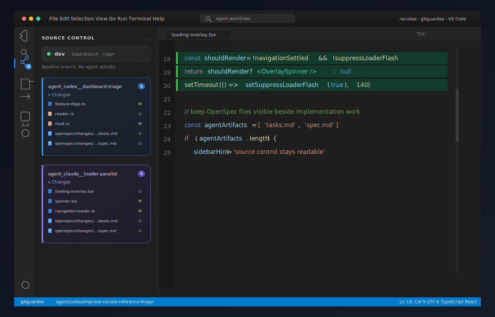
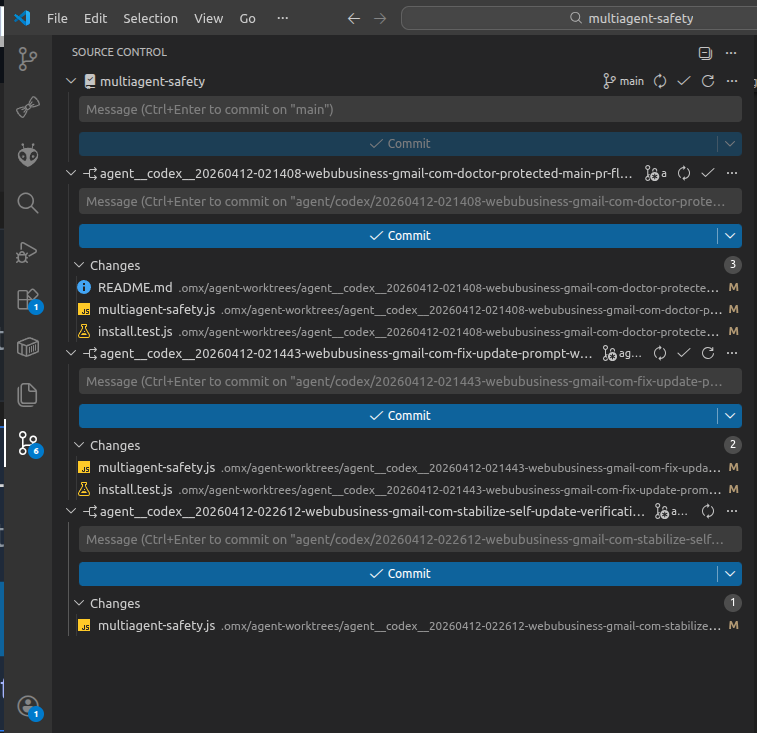
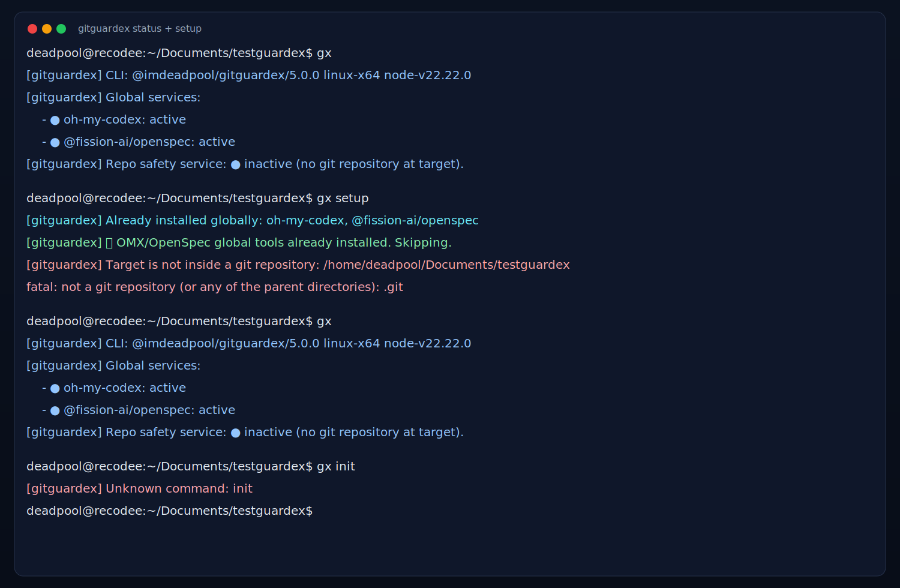

# Reddit Post Kit for GitGuardex

Source baseline: [`README.md`](../README.md)

Project links:
- GitHub: https://github.com/recodeecom/multiagent-safety
- npm: https://www.npmjs.com/package/@imdeadpool/guardex

## Recommended Title Options

1. `I open-sourced GitGuardex: Git guardrails for multi-agent coding workflows`
2. `GitGuardex (npm): safer branch + file-ownership workflow for parallel coding agents`
3. `Built an OSS CLI to stop multi-agent Git collisions (GitGuardex)`

## Copy-Ready Reddit Post (long)

I open-sourced **GitGuardex**, a CLI that adds guardrails for multi-agent coding in Git repos.

The goal is simple: if several agents (or teammates) work in parallel, prevent the common failure modes before they land in `main`.

What it does:

- enforces isolated agent branches/worktrees
- protects base branches (`main`, `master`, `dev`, plus configurable extras)
- supports file ownership locks to reduce agent collisions
- blocks risky deletion flows for claimed files
- includes setup/doctor scripts to bootstrap and repair workflow safety

Quick start:

```bash
npm i -g @imdeadpool/guardex
gx setup
```

Useful follow-up commands:

```bash
gx doctor
bash scripts/agent-branch-start.sh "task" "agent-name"
python3 scripts/agent-file-locks.py claim --branch "$(git rev-parse --abbrev-ref HEAD)" <file...>
bash scripts/agent-branch-finish.sh --branch "$(git rev-parse --abbrev-ref HEAD)"
```

If you run Codex/Claude-style parallel workflows, I would value feedback on edge cases your team hits in production.

GitHub: https://github.com/recodeecom/multiagent-safety  
npm: https://www.npmjs.com/package/@imdeadpool/guardex

## Copy-Ready Reddit Post (short)

I open-sourced **GitGuardex** for safer multi-agent Git workflows.

It adds branch/worktree guardrails, protected-branch enforcement, file-lock ownership, and repair scripts (`gx setup` / `gx doctor`) so parallel agent execution is safer by default.

```bash
npm i -g @imdeadpool/guardex
gx setup
```

GitHub: https://github.com/recodeecom/multiagent-safety  
npm: https://www.npmjs.com/package/@imdeadpool/guardex

## Images to include in the Reddit post

Use these in a gallery post or as follow-up images in comments:

1. Multi-agent dashboard overview  
   `https://raw.githubusercontent.com/recodeecom/multiagent-safety/main/docs/images/dashboard-multi-agent.png`
2. Agent branch/worktree start protocol  
   `https://raw.githubusercontent.com/recodeecom/multiagent-safety/main/docs/images/workflow-branch-start.svg`
3. Lock + deletion guard protocol  
   `https://raw.githubusercontent.com/recodeecom/multiagent-safety/main/docs/images/workflow-lock-guard.svg`
4. Source-control multi-branch visibility  
   `https://raw.githubusercontent.com/recodeecom/multiagent-safety/main/docs/images/workflow-source-control.svg`
5. Real VS Code Source Control layout  
   `https://raw.githubusercontent.com/recodeecom/multiagent-safety/main/docs/images/workflow-vscode-guardex-real.png`
6. Setup/status screenshot  
   `https://raw.githubusercontent.com/recodeecom/multiagent-safety/main/docs/images/setup-success.svg`

## Embedded image previews (for docs)





